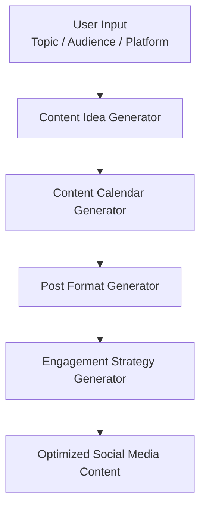

# 🚀 AI Content Strategy Generator

### Build smarter content strategies using Generative AI

AI-powered system for **content ideation, planning, post creation, and engagement growth**

---

# 📌 Table of Contents

- [Project Overview](#-project-overview)
- [AI System Architecture](#-ai-system-architecture)
- [System Workflow](#-system-workflow)
- [Project Structure](#-project-structure)
- [Explore Modules](#-explore-modules)
- [Creator Workflow](#-creator-workflow)
- [Benefits](#-benefits)
- [Key Insight](#-key-insight)

---

# 🧠 Project Overview

The **AI Content Strategy Generator** is a modular framework designed to help creators, marketers, and businesses build **high-performing content strategies using Generative AI**.

The system demonstrates how AI can support the entire **content creation pipeline**, including:

✔ Content idea generation  
✔ Strategic content planning  
✔ Post structure design  
✔ Engagement optimization  

This project highlights how **AI and prompt engineering can support digital marketing workflows**.

---

# 🧠 AI System Architecture

---

# 🔄 System Workflow

<pre>
Topic / Audience / Platform
        │
        ▼
Content Idea Generator
        │
        ▼
Content Calendar Generator
        │
        ▼
Post Format Generator
        │
        ▼
Engagement Strategy Generator
</pre>

This represents a **complete AI-assisted content creation pipeline**.

---

# 📂 Project Structure

<pre>
AI-Content-Strategy-Generator
│
├── README.md
│
├── modules
│   ├── content-idea-generator.md
│   ├── content-calendar-generator.md
│   ├── post-format-generator.md
│   └── engagement-strategy-generator.md
</pre>

Each module represents a **stage in the content strategy workflow**.

---

# 📚 Explore Modules

| Module | Description |
|------|-------------|
| 💡 [Content Idea Generator](modules/content-idea-generator.md) | Generates engaging content ideas |
| 📅 [Content Calendar Generator](modules/content-calendar-generator.md) | Creates weekly posting plans |
| ✍️ [Post Format Generator](modules/post-format-generator.md) | Converts ideas into structured posts |
| 🔥 [Engagement Strategy Generator](modules/engagement-strategy-generator.md) | Designs engagement strategies |

---

# 🚀 Creator Workflow

<pre>
Step 1 → Generate Content Ideas

Step 2 → Plan Weekly Content Calendar

Step 3 → Convert Idea Into Post Format

Step 4 → Apply Engagement Strategy

Step 5 → Publish Content
</pre>

This workflow helps creators move from **idea → structured content → audience engagement**.

---

# 🎯 Use Cases

This system can support:

- Social media content planning
- Personal brand growth
- Digital marketing strategies
- Creator content pipelines
- AI-assisted marketing workflows

---

# ⚡ Benefits

✔ Faster content planning  
✔ Structured content workflow  
✔ Higher engagement potential  
✔ AI-assisted marketing strategy  

---

# 💡 Key Insight

High-performing content usually follows a simple formula:

<pre>
Idea → Structure → Value → Conversation
</pre>

Creators who use **structured systems instead of random posting** tend to achieve **consistent audience growth and engagement**.

---

⭐ *This project demonstrates how Generative AI can be used to design scalable content strategies for digital platforms.*
